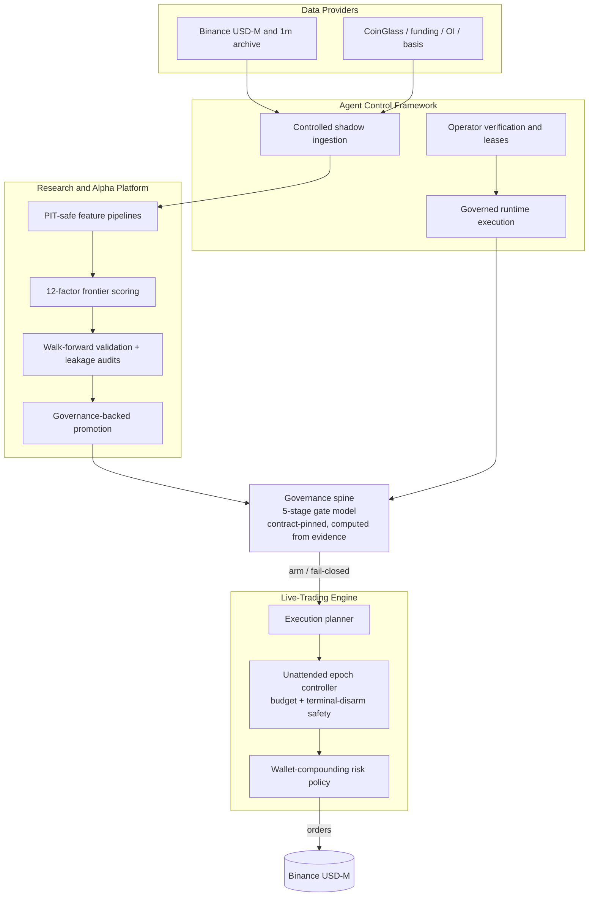

<!--
  PUBLIC SANITIZED MIRROR — see PUBLIC_MIRROR.md for the full sanitization manifest.
-->

> ## ⚠️ Public Sanitized Mirror
>
> This repository is a **sanitized public mirror** of a private quant-trading platform, published to show the
> engineering and architecture — **not** to run a live strategy. The following are **redacted or removed** for
> safety and IP protection (the algorithm/scoring code itself is intact):
>
> - **Fitted alpha** — the 12-factor frozen-frontier weight vector and the research/overlay weights are zeroed
>   placeholders. The scoring machinery is present; the values that constitute the edge are not shipped.
> - **Research artifacts** — `artifacts/` (alpha cards, backtests, governance/registry records) is excluded;
>   only the generation code remains.
> - **Live operational logs** — dated deployment runbooks, arm handoffs, owner attestations, and balance
>   snapshots under `docs/live_trading/` are excluded.
> - **Real infrastructure & account data** — production/internal IPs, SSH targets, wallet/equity balances, and
>   the operator username are replaced with documentation placeholders (RFC 5737 ranges, round numbers).
>
> No API keys, secrets, or credentials were ever committed. Full manifest: [`PUBLIC_MIRROR.md`](PUBLIC_MIRROR.md).

---

# Meridian Alpha Platform

[](https://github.com/junsier9/meridian-public/actions/workflows/boundary-gates.yml)
[](LICENSE)
[](https://www.python.org/)
[](#)

> **A dual-track quantitative platform** — a governance-gated agent-execution framework paired with a
> systematic crypto alpha-research engine for Binance USD-M perpetual futures. Built **fail-closed**,
> **contract-pinned**, and **evidence-driven**.

### ✨ Highlights

- 🛡️ **Fail-closed governance** — a five-stage gate model (sandbox → automated execution) where every
  promotion is contract-pinned and *computed from evidence*, never hand-edited to pass.
- 🤖 **Agent control framework** — controlled shadow ingestion, governed runtime execution, lease/permit
  boundaries, and operator verification gates.
- 📈 **Systematic alpha research** — point-in-time-safe feature pipelines, a 12-factor cross-sectional
  scoring frontier, walk-forward validation, leakage audits, and governance-backed promotion.
- ⚙️ **Live-trading engine** — a Binance USD-M perp execution planner, an unattended epoch controller with
  layered budget/terminal-disarm safety, and a wallet-compounding risk policy.
- ✅ **Contract-tested** — deterministic Linux CI gates over static, document, dependency, and research
  contracts.

> 📑 **New:** a plain-language methodology overview of the live cross-sectional strategy —
> [`docs/strategy/current24_dynamic_lpf_overview.md`](docs/strategy/current24_dynamic_lpf_overview.md).

### 📦 Repository layout

| Path | What lives here |
|---|---|
| `src/enhengclaw/` | Core packages — `live_trading`, `quant_research`, `agents`, `orchestration`, `providers`, `governance` |
| `scripts/` | Runnable entrypoints — research cycles, live-trading runners, verification gates |
| `config/` | Strategy, governance, and live-trading configuration contracts |
| `tests/` | Contract + behavior test suite |
| `docs/` | Architecture, research-design docs, and the governance model |

### 🗺️ Architecture



> ℹ️ This is a **sanitized public mirror** — see the banner above and [`PUBLIC_MIRROR.md`](PUBLIC_MIRROR.md).

---

`Meridian Alpha Platform` is a Python project for institutional-style dual-track governance. It was formerly named
`EnhengClaw`; the legacy `enhengclaw` Python package, `ENHENGCLAW_*` environment variables, and existing external
artifact directories remain supported during the compatibility migration.

- `Agent Control Framework`: controlled shadow ingestion, governed runtime execution, OpenClaw deployment boundaries, and operator verification.
- `Research & Alpha Platform`: bounded research workbenches, quant research cycles, structured intake queues, and governance-backed promotion into human review surfaces.

The checked-in repository is now at `Stage 4: Automated Execution` according to `config\project_governance\project_profile.json`. Stage 4 is a governance/stage-contract fact, not a standing live-order authorization: broad rollout remains disabled, the current remote runner is disarmed with timers disabled/inactive, and live order flow still requires explicit owner arm/on-host gates.

## Project Profile

- `config\project_governance\project_profile.json` is the machine-readable project identity contract.
- `config\project_governance\stage_contract.json` is the machine-readable stage model and unlock policy.
- `config\scheduled_tasks\manifest.json` is the machine-readable scheduled-task registry for institutional research automation.
- `Research & Alpha Platform` may depend on the governance/runtime framework.
- `Agent Control Framework` must not depend on quant research, scheduled-task, or workbench-specific modules.

## Dependency Contract

- `pyproject.toml` intentionally declares the current clean-install runtime floor: `numpy`, `pandas`, `scikit-learn`, and `websockets` on top of the Python stdlib.
- CI runs `python scripts/verify/run_dependency_contract.py` after `python -m pip install -e .` so operator-facing entrypoints cannot quietly grow undeclared dependencies.
- If that clean-install contract starts failing, the missing runtime dependency must be added to `pyproject.toml` instead of being left as an operator-side surprise.

## Operator Host Contract

- The current operator workflow is a single Windows host contract: `%LOCALAPPDATA%` stores retained bundles, `C:\ProgramData\EnhengClaw\trust` is the read-only trust root, and WSL hosts the active OpenClaw workspaces.
- Linux and macOS CI jobs in this repository cover static/documentation/install contracts only. They do not mean cross-platform operator deployment is supported today.

## Document Roles

- `README.md` is the project and developer entrypoint.
- `AGENTS.md` is the dense agent startup page: read order, red lines, and evidence-reading rules.
- `CLAUDE.md` is a legacy compatibility entrypoint and must defer to `AGENTS.md` on startup-role wording.
- `docs\README_FOR_AGENT.md` is the explanatory agent onboarding guide: project map, glossary, artifact vocabulary, and failure routing.
- `PROJECT_STATE.md` is the canonical truth source for checked-in facts and accepted evidence.
- `CANONICAL_RUNBOOK.md` is the exact command and failure-routing source.

## Stage Model

- `Stage 0`: sandbox/framework-only
- `Stage 1`: research/readiness only
- `Stage 2`: manual export + human review
- `Stage 3`: human-approved execution
- `Stage 4`: automated execution

Current checked-in stage is `Stage 4: Automated Execution`. Stage 4 satisfies the stage-contract minimum for automated-execution review, but it does not flip broad rollout or live order flow by itself; those remain governed by manifest state, owner records, on-host gates, budget epochs, and fail-closed runtime controls.

## Promotion Boundary

- Quant research may not export directly to the workbench by reading mutable status files alone.
- Governance now writes one `promotion_decision` artifact per exportable alpha under `RunArtifactsRoot\governance\promotion_decisions\<as_of>\`.
- `bridge.py` may export only alphas with an `approved` promotion artifact whose hashes still match the current alpha card and strategy source.
- Quant bridge publication is governed by `config\quant_research\publication_contract.json`: Stage 0/1 are archive-only, live backend outputs may become publishable only through approved promotion decisions, matching hashes/freshness, explicit `backend_mode`, `publication_status`, and `validation` fields, and the bridge contract. Deterministic outputs remain non-publishable.
- Stage 4 does not relax the quant bridge evidence boundary; it only removes the old Stage 0/1 stage-only archive lock when all other publication gates pass.

## Artifact Vocabulary

- `<ArtifactsRoot>` means the operator-supplied root for the formal real-24h bundle only.
- `RunArtifactsRoot` means a generated per-run root for owner, review, demo, and readiness flows. Repo-local `artifacts\...` paths are examples, not required checkout state.
- `ObjectArtifactsRoot` means a generated per-object workbench root. Repo-local `artifacts\research_workbench\<object_id>` is one example, not a required path contract.

## Canonical Execution Boundary

- Runtime kernel: `RuntimeOrchestrator.run_new`
- Canonical source-backed lane: `ProviderSnapshotRunner.run_once`
- Controller-visible source contract: `ProviderSourceSpec`
- Governed agent slices remain limited to `runtime.run_new_from_agent_payloads` and `runtime.continue_existing_from_agent_payloads`
- Governed agent control-plane topology is defined by `config/agent_architecture/main_owner_manifest.json`
- The persistent owner-centered design note lives in `docs/agents/OWNER_AGENT_ARCHITECTURE.md`
- Current high-level callers on that lane:
  - `PilotRunner`
  - `BatchPilotRunner`
  - `ShadowPromotionRunner`
  - `ShadowAdmissionRunner`
  - `ContributionLedger`

Retired controller execution APIs stay blocked. The frozen migration list lives in `docs/EXECUTION_BOUNDARY_MIGRATION.md`.

## Package Layout

- `src/enhengclaw/core`: execution control, runtime state, and core domain rules
- `src/enhengclaw/agents`: governed controlled slices, executable raw-input compiler slices, and optional operator review surfaces
- `src/enhengclaw/orchestration`: worker boundaries, runtime orchestration, and pilot runners
- `src/enhengclaw/providers`: live, replay, and shadow provider implementations
- `src/enhengclaw/ingress`: replay/quarantine writers and ingress validation
- `src/enhengclaw/governance`: provider selection, promotion, admission, and contribution logic
- `src/enhengclaw/ops`: review packs, drift inspection, and runtime ops reports
- `src/enhengclaw/testing`: execution testbed utilities reused by tests and verification scripts
- `scripts`: verification, drills, soak runners, and red-team entrypoints
- `tests`: repository test suite

## Canonical Commands

Install in editable mode:

```powershell
python -m pip install -e .
```

The clean-install contract intentionally stops there: no extra HTTP client or SDK dependency is required unless `run_dependency_contract.py` proves otherwise.

Run the public single-symbol replay smoke path:

```powershell
python examples\pilot_runner_demo.py --symbol AIX --scope spot+perp
```

Run the public batch replay smoke path:

```powershell
python examples\batch_pilot_runner_demo.py AIX BTC ETH --scope spot+perp
```

Run the public governed market-observer executable slice:

```powershell
python examples\governed_agent_ingress_demo.py market_observer --subject AIX --scope spot+perp --object-id market-observer-aix --observation-text "AIX still shows supportive structure with a higher low above intraday support and no immediate breakdown signal."
```

The canonical `market_observer` command now defaults to the live OpenAI-compatible compiler backend and fails closed when `ENHENGCLAW_MARKET_OBSERVER_MODEL_BASE_URL`, `ENHENGCLAW_MARKET_OBSERVER_MODEL_NAME`, or `ENHENGCLAW_MARKET_OBSERVER_API_KEY` is missing. Use `--compiler-backend recorded --recorded-transcript <path>` for offline replay, or `--compiler-backend deterministic` only for explicit low-level fallback/debug work.

Minimal market-research workflow:

- `docs\MINIMAL_MARKET_RESEARCH_WORKFLOW.md` is the canonical low-friction research path when you want to use existing Skills and governed thesis objects without depending on real-time provider ingestion, the 24h shadow bundle, or the OpenClaw deployment boundary.
- The default research mode is `hybrid`: collect one manual snapshot from Skills, compress it into `observation / evidence / risk / next_step`, and write those texts through the existing governed slices.
- The minimal research chain is `market_observer -> evidence_agent -> risk_signal_agent -> research_synthesizer -> research_lead`.
- The default v1 backend for this path is `--compiler-backend deterministic`; switch to `live` later only when the research workflow itself is already stable.
- A common repo-local example for `ObjectArtifactsRoot` in this path is `artifacts\research_workbench\<object_id>`.
- The research pilot templates live under `docs\templates\market_research\` and include a watchlist template, a cycle snapshot template, and a pain-log template so operators can run `5-10` thesis objects before deciding whether any new API class is justified.

External OpenClaw scheduled research workflow:

- `docs\EXTERNAL_OPENCLAW_RESEARCH_DEPLOYMENT.md` is the canonical scheduler-safe path when external OpenClaw + Skills should write one normalized snapshot per cycle into the thesis workbench through the shipped OpenClaw adapters.
- This path is explicitly research-only: it now runs as an upstream open-market scan plus an hourly thesis consumer, provisions one fresh permit per cycle, defaults to the live OpenAI-compatible compiler backend, retains cycle artifacts under `ObjectArtifactsRoot\cycles\<cycle_id>\` (a common repo-local example is `artifacts\research_workbench\<object_id>\cycles\<cycle_id>\`), and stays separate from both the formal OpenClaw deployment gate and the real-time shadow bundles.
- The public entrypoints are:
  - `python scripts\openclaw\provision_openclaw_research_inputs.py`
  - `python scripts\openclaw\run_openclaw_research_scan.py --market-scan <MarketScanJsonPath>`
  - `python scripts\openclaw\run_openclaw_research_cycle.py --snapshot <SnapshotJsonPath>`
- The tracked external templates live at:
  - `docs\templates\market_research\openclaw_research_market_scan_template.json`
  - `docs\templates\market_research\openclaw_research_snapshot_template.json`
- This workflow also maintains one per-thesis `pain_log.csv` plus workbench-level `api_gap_summary.json` / `api_gap_summary.md`, so if Skills stop being enough it can recommend exactly one next API class to add without failing the cycle.

OpenClaw deployment boundary:

```powershell
python scripts\openclaw\provision_market_observer_live_inputs.py
powershell -ExecutionPolicy Bypass -File scripts\openclaw\run_market_observer_deployment_gate.ps1
python scripts\verify\run_openclaw_market_observer_smoke.py
python scripts\verify\run_openclaw_market_observer_smoke.py --live-smoke --execution-permit <WindowsPermitPath> [--trust-root-dir <WindowsTrustRootDir>] [--retain-root <WindowsRetainRoot>]
python scripts\verify\run_openclaw_continue_existing_live_readiness.py --execution-permit <WindowsPermitPath> [--trust-root-dir <WindowsTrustRootDir>] [--retain-root <WindowsRetainRoot>]
python scripts\verify\run_openclaw_review_gated_live_readiness.py --execution-permit <WindowsPermitPath> [--trust-root-dir <WindowsTrustRootDir>] [--retain-root <WindowsRetainRoot>]
python scripts\verify\run_openclaw_deployment_readiness.py --execution-permit <WindowsPermitPath> [--trust-root-dir <WindowsTrustRootDir>] [--retain-root <WindowsRetainRoot>]
python scripts\verify\run_openclaw_evidence_agent_smoke.py
python scripts\verify\run_openclaw_risk_signal_agent_smoke.py
python scripts\verify\run_openclaw_attention_allocator_smoke.py
python scripts\verify\run_openclaw_research_synthesizer_smoke.py
python scripts\verify\run_openclaw_research_lead_smoke.py
python scripts\verify\run_openclaw_risk_governance_agent_smoke.py
python scripts\verify\run_openclaw_validation_agent_smoke.py
```

All eight shipped lanes now have checked-in OpenClaw deployment boundaries. The active wrapper workspaces live at `\\wsl.localhost\Ubuntu-24.04\root\.openclaw\workspace-enhengclaw-main` and `\\wsl.localhost\Ubuntu-24.04\root\.openclaw\workspace-enhengclaw-audit`, and they call the repo-native adapters under `python -m enhengclaw.integrations.openclaw.<lane>`. This external path stays fail-closed: callers must supply an explicit execution permit, recorded replay requests must also supply an explicit `input_id` together with the transcript path, `market_observer` remains the only create-new lane, and the other seven OpenClaw lanes are resume-only with no `skip_seed` or auto-seed behavior. All eight lanes currently have recorded deployment boundaries. `market_observer` keeps the checked-in create-new live proof path through `run_openclaw_market_observer_smoke.py --live-smoke`, and the seven resume-only lanes now share one archetype-based live rollout:

- `run_openclaw_continue_existing_live_readiness.py` proves live success for `evidence_agent`, `risk_signal_agent`, `attention_allocator`, `research_synthesizer`, and `research_lead`.
- `run_openclaw_review_gated_live_readiness.py` proves live success for `risk_governance_agent` and `validation_agent`, while requiring review artifacts and `review_gate_consistent = true` in audit.
- Each of the seven resume-only per-lane smoke commands now also accepts `--live-smoke --execution-permit <WindowsPermitPath> [--trust-root-dir <WindowsTrustRootDir>] [--retain-root <WindowsRetainRoot>]` on the hardened trust-root baseline.

The formal OpenClaw deployment go/no-go decision still lives only in `python scripts\verify\run_openclaw_deployment_readiness.py --execution-permit <WindowsPermitPath> [--trust-root-dir <WindowsTrustRootDir>] [--retain-root <WindowsRetainRoot>]`, and it now aggregates the eight recorded lane smokes plus `market_observer` live proof plus the two new archetype bundles. `market_observer` also keeps the formal external input workflow:

- `python scripts\openclaw\provision_market_observer_live_inputs.py` refreshes the persistent signer, `owner_review.json`, `batch_approval.json`, and `execution_permit.json` under `%LOCALAPPDATA%\EnhengClaw\openclaw_live_market_observer`, then publishes `trust-root\allowed_signers` to the read-only boundary at `C:\ProgramData\EnhengClaw\trust`.
- `powershell -ExecutionPolicy Bypass -File scripts\openclaw\run_market_observer_deployment_gate.ps1` now applies one unified child-process live env baseline for every live lane in the formal deployment bundle. In a clean PowerShell session, `OPENCLAW` is enough for the default workflow, while `OPENCLAW_BASE_URL`, `OPENCLAW_MODEL_NAME`, and `OPENCLAW_MODEL_TIMEOUT_SECONDS` provide the shared baseline overrides. Each live lane keeps any already-set dedicated `ENHENGCLAW_<LANE>_*` values as overrides, otherwise defaults to the shared baseline and maps the lane API key from `OPENCLAW`. The launcher still does not inject `ENHENGCLAW_ALLOW_WRITABLE_TRUST_ROOT=1`.
- Direct `python scripts\verify\run_openclaw_deployment_readiness.py ...` invocation now builds the same unified child-process live env baseline, so the formal gate remains the only deployment decision boundary while the operator launcher stays a convenience wrapper.
- The historical green operator retained bundle from this hardened default workflow exists under `%LOCALAPPDATA%\EnhengClaw\openclaw_live_market_observer\retained\20260417T164045Z\`, and a direct clean-session formal-gate run also passed under `%LOCALAPPDATA%\EnhengClaw\openclaw_live_market_observer\retained\direct_bundle_env_unified\`. These retained bundles are freshness-gated before any current readiness claim.

Formal real-24h shadow operator path:

```powershell
python scripts\verify\run_real_shadow_acceptance.py --mode verify
python scripts\verify\run_real_24h_shadow_bundle.py --execution-permit <WindowsPermitPath> --artifacts-root <ArtifactsRoot> --preflight-label <PreflightLabel> --rerun-label <RerunLabel> [--trust-root-dir <WindowsTrustRootDir>]
```

- `run_real_shadow_acceptance.py --mode verify` remains the canonical internal real-shadow verify gate.
- `run_real_24h_shadow_bundle.py` is now the formal operator bundle for `preflight-only -> rerun -> rerun verdict`.
- `scripts\run_shadow_24h.ps1` remains the low-level rerun launcher reused by the bundle, not the formal decision boundary.
- The bundle writes wrapper-level retained evidence under `<ArtifactsRoot>\real_24h_bundles\<RerunLabel>\`, while keeping preflight evidence in `<ArtifactsRoot>\preflight_only\<PreflightLabel>\` and rerun evidence in `<ArtifactsRoot>\soak_runs\<RerunLabel>\`. `<ArtifactsRoot>` is an operator-supplied path contract, not a claim that a fresh checkout already contains those directories.
- Real-24h permit admission uses `86460.0`, which means `24h + 60s`; the shorter non-real margin defaults are not valid replacements for this gate.
- Historical host validation includes a real external-permit preflight-green bundle at `%LOCALAPPDATA%\EnhengClaw\real_shadow_bundle_validation\preflight_only\preflight-bundle-validation-20260418T1145Z\` and a short-duration wiring run at `%LOCALAPPDATA%\EnhengClaw\real_shadow_bundle_validation\real_24h_bundles\rerun-short-bundle-20260418T1146Z\`; current claims must pass `run_evidence_freshness_contract.py`.
- Real 24h readiness claims must still not exceed the latest successful full-duration rerun bundle produced by `run_real_24h_shadow_bundle.py`; the short-duration wiring run above proves bundle wiring and retained evidence shape only.

Mainnet strategy-only remote update lane:

- `docs\live_trading\hv_balanced_binance_usdm_pipeline\strategy_only_remote_update_runbook_2026_06_13.md` is the lightweight path for future live strategy input updates that do not touch order submission, execution planning, unattended control, owner intent, risk gates, systemd, or account-control surfaces.
- This lane still requires remote read-only precheck, committed source, archive sync, actual live config readback, systemd/operator/budget-state readback, and optional no-order proof. It must not manually trigger timers or submit orders.
- Changes to execution/risk/controller/timer/account-control code must use the heavier validation path instead.

Run the public governed evidence-agent executable slice:

```powershell
python examples\governed_agent_ingress_demo.py evidence_agent --subject AIX --scope spot+perp --object-id evidence-agent-aix --evidence-text "Fresh desk notes still show aggressive buyers supporting AIX after the initial breakout."
```

The canonical `evidence_agent` command now defaults to the live OpenAI-compatible compiler backend and fails closed when `ENHENGCLAW_EVIDENCE_AGENT_MODEL_BASE_URL`, `ENHENGCLAW_EVIDENCE_AGENT_MODEL_NAME`, or `ENHENGCLAW_EVIDENCE_AGENT_API_KEY` is missing. Use `--compiler-backend recorded --recorded-transcript <path>` for offline replay, or `--compiler-backend deterministic` only for explicit low-level fallback/debug work.

Run the promoted follow-up risk slice:

```powershell
python examples\governed_agent_ingress_demo.py risk_signal_agent --subject AIX --scope spot+perp --object-id risk-signal-aix --risk-text "Fresh tape action now shows a clear invalidation risk after buyers lost the prior support shelf."
```

Run the additional promoted follow-up governed slices:

```powershell
python examples\governed_agent_ingress_demo.py risk_governance_agent --subject AIX --scope spot+perp --object-id risk-governance-aix --governance-text "The object now carries a live governance suppression need because risk remains unresolved and publish should stay disabled."
python examples\governed_agent_ingress_demo.py validation_agent --subject AIX --scope spot+perp --object-id validation-agent-aix --validation-text "Validation should stay on hold because the latest thesis conflict is unresolved and the publish gate is still not legally clear."
python examples\governed_agent_ingress_demo.py attention_allocator --subject AIX --scope spot+perp --object-id attention-allocator-aix --attention-text "Keep attention elevated because the object still needs targeted monitoring around the latest conflict."
python examples\governed_agent_ingress_demo.py research_synthesizer --subject AIX --scope spot+perp --object-id research-synthesizer-aix --synthesis-text "Current bounded synthesis still leans constructive, but conflict risk remains high enough that this should stay a preview rather than a final thesis."
python examples\governed_agent_ingress_demo.py research_lead --subject AIX --scope spot+perp --object-id research-lead-aix --directive-text "Next stage should focus on a targeted refresh of the conflict evidence before any publication path is reconsidered."
```

Inspect the secondary read-only operator review surfaces:

```powershell
python examples\rulebook_agent_review_demo.py risk_governance_agent --artifacts-root artifacts\governed_demo
python examples\rulebook_agent_review_demo.py validation_agent --artifacts-root artifacts\governed_demo
python examples\rulebook_agent_review_demo.py attention_allocator --artifacts-root artifacts\governed_demo
python examples\rulebook_agent_review_demo.py research_synthesizer --artifacts-root artifacts\governed_demo
python examples\rulebook_agent_review_demo.py research_lead --artifacts-root artifacts\governed_demo
```

The replay demos and governed-agent demos self-provision a temporary execution permit by default. Use `--execution-permit <path>` when you want to run with an external permit/trust-root setup instead. Add `--require-external-permit` on the governed-agent demo when you want the command to fail closed unless a caller-supplied permit is present. `evidence_agent` seeds and continues by default, so external single-use permits must be paired with `--skip-seed` when resuming an already-persisted object. On Windows, the batch demo defaults to `C:\ecpb\...`, and the governed executable-slice demos default to a short `ecgd` temp root, so the generated archive tree stays below common path-length limits. When the batch demo self-provisions permits for multiple symbols, it emits one batch root per symbol.

Current shipped governed slice modes:

- `market_observer`: `create_new_object`, accepts raw observation text, runs a model-backed compiler by default, records `input / prompt / request / raw output / transcript / parsed draft` artifacts, and then writes through the owner-first governed path
- `evidence_agent`: `continue_existing_object`
- `evidence_agent` is now the second checked-in executable slice: it accepts bounded raw evidence text, compiles against existing-object context, records full execution/transcript artifacts, and then writes through the owner-first governed path
- `risk_signal_agent`: `continue_existing_object`, accepts bounded raw risk text, runs a model-backed compiler by default, records full execution/transcript artifacts, and is now one of the shipped promoted follow-up governed slices on the public path
- `risk_governance_agent`, `validation_agent`, `attention_allocator`, `research_synthesizer`, and `research_lead` also accept bounded raw input, run model-backed compiler pipelines by default, and now execute on the public governed path
- `docs\MINIMAL_MARKET_RESEARCH_WORKFLOW.md` is the canonical repo-local runbook for swing-thesis research that intentionally avoids real-time ingestion and uses the governed slices as an object-management layer rather than a live monitoring layer
- Checked-in agent control plane uses one explicit owner: `rulebook_owner`
- Owner control-plane artifacts live under `RunArtifactsRoot\agent_owner\<run_id>\`; repo-local `artifacts\agent_owner\<run_id>\` is only one generated example.
- Agent-layer governance is computed from `config/agent_layer_governance/manifest.json`, `config/agent_layer_governance/governed_slice_registry.json`, and shadow-acceptance evidence.
- The checked-in governed-slice registry currently admits all eight exported agent ids, and it may admit only promotion-grade governed-slice candidates that satisfy `controlled_agent_slice_promotion.v1`.
- Registry admission does not by itself make a slice shipped; `go_no_go.agent_layer_governance.current_controlled_slice_ids` stays separate from `registered_pending_promotion_controlled_slice_ids`.
- The checked-in manifest currently allows all eight shipped slice ids and keeps the broad agent layer disabled by default.
- `python scripts\verify\run_operational_readiness.py` is the canonical verify entry that proves all eight governed slices are current/shipped while the broad agent layer remains disabled.
- `python scripts\verify\run_agent_architecture_contract.py` validates the checked-in owner manifest and owner artifact contract.
- `python scripts\verify\run_market_observer_execution.py` is the canonical offline verify entry for the executable `market_observer` raw-input slice, its recorded `success | blocked | quarantine` golden fixtures, and the live backend transport/parser unit tests.
- `python scripts\verify\run_market_observer_execution.py --live-smoke` runs one explicit live compiler smoke when the required `ENHENGCLAW_MARKET_OBSERVER_*` environment variables are present.
- `python scripts\verify\run_openclaw_market_observer_smoke.py`, `run_openclaw_evidence_agent_smoke.py`, `run_openclaw_risk_signal_agent_smoke.py`, `run_openclaw_attention_allocator_smoke.py`, `run_openclaw_research_synthesizer_smoke.py`, `run_openclaw_research_lead_smoke.py`, `run_openclaw_risk_governance_agent_smoke.py`, and `run_openclaw_validation_agent_smoke.py` are the canonical per-lane OpenClaw deployment smokes; together they prove recorded deployment boundaries for all eight shipped lanes, and all eight now expose checked-in live proof paths through either `market_observer --live-smoke` or the two continue-existing archetype bundles.
- `python scripts\verify\run_openclaw_continue_existing_live_readiness.py --execution-permit <WindowsPermitPath> [--trust-root-dir <WindowsTrustRootDir>] [--retain-root <WindowsRetainRoot>]` is the canonical archetype live bundle for the five non-review resume-only lanes.
- `python scripts\verify\run_openclaw_review_gated_live_readiness.py --execution-permit <WindowsPermitPath> [--trust-root-dir <WindowsTrustRootDir>] [--retain-root <WindowsRetainRoot>]` is the canonical archetype live bundle for the two review-gated resume-only lanes.
- `python scripts\verify\run_openclaw_deployment_readiness.py --execution-permit <WindowsPermitPath> [--trust-root-dir <WindowsTrustRootDir>] [--retain-root <WindowsRetainRoot>]` is now the single formal OpenClaw deployment decision gate; it aggregates the eight recorded lane smokes plus the `market_observer` live proof plus the two archetype live bundles into one machine-readable retained evidence bundle.
- `python scripts\openclaw\provision_market_observer_live_inputs.py` and `powershell -ExecutionPolicy Bypass -File scripts\openclaw\run_market_observer_deployment_gate.ps1` are the canonical operator-side input workflow for that gate; they keep signer / permit / retained artifacts under `%LOCALAPPDATA%\EnhengClaw\openclaw_live_market_observer`, publish the read-only trust-root to `C:\ProgramData\EnhengClaw\trust`, and then launch the deployment decision gate with those fresh external inputs.
- `python scripts\verify\run_evidence_agent_execution.py` is the canonical offline verify entry for the executable `evidence_agent` raw-input slice, its recorded `success | blocked | quarantine` golden fixtures, and the live backend transport/parser unit tests.
- `python scripts\verify\run_evidence_agent_execution.py --live-smoke` runs one explicit live compiler smoke when the required `ENHENGCLAW_EVIDENCE_AGENT_*` environment variables are present.
- `python scripts\verify\run_risk_signal_agent_execution.py` is the canonical offline verify entry for the promoted raw-input `risk_signal_agent` slice, including direct execution acceptance and public promoted-path acceptance.
- `python scripts\verify\run_risk_governance_agent_execution.py`, `run_validation_agent_execution.py`, `run_attention_allocator_execution.py`, `run_research_synthesizer_execution.py`, and `run_research_lead_execution.py` are the canonical offline verify entries for the five additionally promoted raw-input execution slices; each proves compiler/recorded/live plumbing plus public promoted-path acceptance.
- `python scripts\verify\run_broad_agent_layer_readiness.py` is the canonical verify bundle for the checked-in broad-ready state.
- `python scripts\verify\run_operational_readiness.py` now supports `--attempts <N>` and `--retain-root <path>` so the readiness gate can prove repeated stability and retain per-attempt evidence.
- `python scripts\verify\run_broad_agent_layer_readiness.py` now embeds `python scripts\verify\run_operational_readiness.py --attempts 3` and only passes when all three operational-readiness attempts succeed with retained evidence.
- “stable, repeatable green gates” now refers to that repeated verification path, not to a single lucky green run.
- `python examples\governed_agent_ingress_demo.py risk_signal_agent ...` is now a shipped promoted raw-input executable slice on the public governed path.
- `python examples\governed_agent_ingress_demo.py risk_governance_agent ...`, `validation_agent ...`, `attention_allocator ...`, `research_synthesizer ...`, and `research_lead ...` are now shipped promoted raw-input executable slices on the public governed path.
- `attention_allocator`, `risk_governance_agent`, `validation_agent`, `research_synthesizer`, and `research_lead` expose `operator_review_surface` as a secondary read-only reviewer/debug lane.
- The checked-in target state is now:
  - `agent_layer_governance_enabled = true`
  - `current_controlled_slice_ids = ["market_observer", "attention_allocator", "evidence_agent", "research_lead", "research_synthesizer", "risk_governance_agent", "risk_signal_agent", "validation_agent"]`
  - `registered_pending_promotion_controlled_slice_ids = []`
  - `broad_agent_layer_ready = true`
  - `broad_agent_layer_enabled = false`
  - all eight shipped lanes now have checked-in OpenClaw deployment boundaries, but this remains a thin external adapter layer rather than a broad rollout

Run the repository verification gates:

```powershell
python scripts\verify\run_market_observer_execution.py
python scripts\verify\run_market_observer_execution.py --live-smoke
python scripts\verify\run_openclaw_market_observer_smoke.py
python scripts\verify\run_openclaw_market_observer_smoke.py --live-smoke --execution-permit <WindowsPermitPath> [--trust-root-dir <WindowsTrustRootDir>] [--retain-root <WindowsRetainRoot>]
python scripts\verify\run_openclaw_deployment_readiness.py --execution-permit <WindowsPermitPath> [--trust-root-dir <WindowsTrustRootDir>] [--retain-root <WindowsRetainRoot>]
python scripts\verify\run_openclaw_evidence_agent_smoke.py
python scripts\verify\run_openclaw_risk_signal_agent_smoke.py
python scripts\verify\run_openclaw_attention_allocator_smoke.py
python scripts\verify\run_openclaw_research_synthesizer_smoke.py
python scripts\verify\run_openclaw_research_lead_smoke.py
python scripts\verify\run_openclaw_risk_governance_agent_smoke.py
python scripts\verify\run_openclaw_validation_agent_smoke.py
python scripts\verify\run_evidence_agent_execution.py
python scripts\verify\run_evidence_agent_execution.py --live-smoke
python scripts\verify\run_risk_signal_agent_execution.py
python scripts\verify\run_risk_governance_agent_execution.py
python scripts\verify\run_validation_agent_execution.py
python scripts\verify\run_attention_allocator_execution.py
python scripts\verify\run_research_synthesizer_execution.py
python scripts\verify\run_research_lead_execution.py
python scripts\verify\run_governed_agent_ingress.py
python scripts\verify\run_risk_signal_agent_pending.py
python scripts\verify\run_risk_governance_agent_pending.py
python scripts\verify\run_validation_agent_pending.py
python scripts\verify\run_attention_allocator_pending.py
python scripts\verify\run_research_synthesizer_pending.py
python scripts\verify\run_research_lead_pending.py
python scripts\verify\run_agent_architecture_contract.py
python scripts\verify\run_rulebook_agent_review_samples.py
python scripts\verify\run_broad_agent_layer_readiness.py
python -m unittest discover -s tests -p "test*.py"
python scripts\verify\run_boundary_gates.py
python scripts\verify\run_operational_readiness.py
python scripts\redteam\final_boundary_acceptance.py
```

## Archived Or Low-Level Demos

- `examples/legacy/` contains archived demos that are no longer the operator path.
- `examples/runtime_demo.py`, `examples/runtime_batch_demo.py`, `examples/scenario_cases.py`, and `examples/snapshot_adapter_demo.py` are low-level kernel samples, not the canonical provider/snapshot entrypoint.
