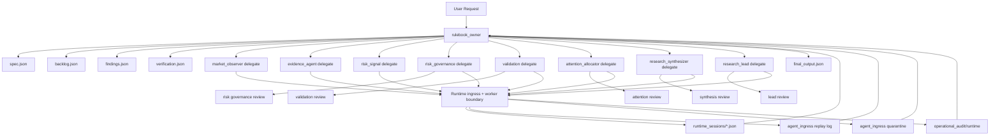

# Owner Agent Architecture

## Goal

This document replaces the implicit "many narrow agent slices are the architecture" assumption with one explicit owner-centered contract for the `Agent Control Framework` track.

`EnhengClaw` is now a checked-in dual-track project: the framework track provides governed control-plane and runtime boundaries, while the research-platform track may consume those boundaries. The dependency direction is one-way. Research automation may depend on the framework; the framework must not depend on quant-research or workbench-specific modules.

The checked-in target is:

- one main owner agent: `rulebook_owner`
- existing runtime-facing slices kept as bounded delegates for compatibility
- review surfaces treated as explicit reviewer tools, not accidental side-effects
- critical state externalized into replayable owner artifacts
- verification required before the owner records a final output

Current status note:

- the owner topology contract is checked in today
- the runtime ownership phase is machine-declared in `config/project_governance/runtime_ownership_contract.json`
- the current checked-in runtime ownership phase is `partial`
- six compatibility delegates still share the legacy continue-existing runtime boundary
- owner-side final verification is required by contract, and `owner_verification_enforced_in_boundary_gates = true` today

## Why This Refactor Exists

Current governed slices are structurally safe, but the agent layer is still mostly thin wrappers:

- six pending delegates all share the same `runtime.continue_existing_from_agent_payloads` boundary
- per-agent tool wrappers differ mostly by scenario string
- pending demo commands share one helper path
- review logic exists, but not every write-side role had an explicit reviewer surface

That shape makes the code easy to test locally, but it hides the actual control plane:

- no explicit owner of user intent
- no externalized backlog/progress/finalization bundle
- no single machine-readable topology manifest
- no required owner-side verification checkpoint before "done"

## Current Topology Summary

This section describes the current runtime shape, not the fully completed end state.

### Shipped runtime write surfaces

- `market_observer`
  - creates one new object via `runtime.run_new_from_agent_payloads`
- `evidence_agent`
  - continues one existing object via `runtime.continue_existing_from_agent_payloads`

### Pending runtime write delegates

- `risk_signal_agent`
- `risk_governance_agent`
- `validation_agent`
- `attention_allocator`
- `research_synthesizer`
- `research_lead`

All six continue an existing object and each may emit exactly one payload.

Those six delegates are still compatibility surfaces, not proof that runtime ownership migration is complete.

### Review surfaces

- `attention_allocator` review
- `risk_governance_agent` review
- `validation_agent` review
- `research_synthesizer` review
- `research_lead` review

These are read-only inspection paths that help the owner validate or explain a write decision.

## Target Structure

### Main owner

`rulebook_owner` owns:

- user intent
- delegation choice
- artifact initialization
- reviewer invocation
- verification checklist
- final output

### Delegates

Delegates stay bounded and runtime-safe:

- no delegate owns the final response
- every delegate has exactly one structured input schema
- every delegate has exactly one structured runtime write boundary
- review-capable delegates expose a read-only reviewer surface

### Artifacts

The owner writes explicit state to `artifacts/agent_owner/{run_id}/`:

- `spec.json`
- `backlog.json`
- `findings.json`
- `verification.json`
- `final_output.json`

These files are the durable handoff and recovery surface. Runtime session state, replay logs, quarantine logs, and worker audit files remain authoritative runtime evidence, but the owner artifacts are now the explicit agent-control-plane evidence.

## Mermaid

## Migration Notes

### Kept

- existing governed runtime agent ids
- existing ingress firewall
- existing worker boundary
- existing governance manifest and registry

### Added

- `config/agent_architecture/main_owner_manifest.json`
- `src/enhengclaw/agents/architecture.py`
- `src/enhengclaw/agents/owner_state.py`
- explicit owner artifact bundle
- review surfaces for `risk_governance_agent` and `validation_agent`

### Refined

- tool binding now has an explicit owner manifest
- review surfaces are treated as reviewer lanes, not incidental helpers
- broad readiness verification now includes the owner-architecture contract

### Compatibility

- existing runtime agent ids and demo commands remain in place
- existing write tools remain in place
- existing pending verify scripts remain in place
- the owner architecture sits above them as the new control-plane contract
- runtime ownership still remains `partial` because six compatibility delegates continue to share the legacy continue-existing boundary even though boundary gates now enforce owner verification

## Validation

The checked-in validation now expects:

- exactly one owner in `main_owner_manifest.json`
- every delegate to reference a real runtime agent id
- every agent to declare structured inputs, outputs, tools, stop conditions, and fallback
- owner artifacts to be writeable and reloadable
- review demos for every explicitly declared reviewer surface
